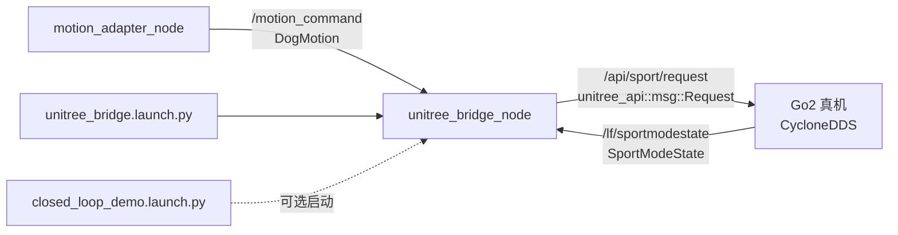

## 用户需求

将当前机器狗导航系统（步骤5-6）与宇树 Go2 真机对接。具体要求：

- 操作系统：Ubuntu 22.04 + ROS 2 Humble
- 对接方案：方案B —— 新建独立 `unitree_bridge_node`，不修改现有 motion_adapter_node
- 使用 `unitreerobotics/unitree_ros2` 仓库（ROS2 原生包，基于 CycloneDDS）
- 需要完整的从零环境搭建流程：系统依赖安装、仓库拉取、编译构建

## 核心功能

- 新建 `unitree_bridge_node`：订阅 `/motion_command` (DogMotion)，翻译为宇树 Go2 Sport API 调用
- 发布 `unitree_api::msg::Request` 到 `/api/sport/request`，订阅 `/lf/sportmodestate` 获取机器人状态反馈
- 安全状态映射：STOP/MANUAL → Damp(1001) 急停，PAUSE → StopMove(1003)，SLOW/NORMAL → Move(1008)
- 步态自动切换：WALK→StaticWalk(1061)，TROT→TrotRun(1062)，CRAWL→EconomicGait(1063)
- 速度档位映射：speed_limit → SpeedLevel(1015)
- 新建 `unitree_bridge.launch.py` 启动文件，更新 `closed_loop_demo.launch.py` 增加可选 bridge 启动
- 新建 `unitree_bridge.yaml` 配置文件

## 不修改范围

- motion_adapter_node 及所有现有节点零改动
- 现有 launch 文件不删除，新增并行启动入口
- 仿真测试场景（不需要真机）照常运行

## 技术栈

- 语言：Python 3（与现有项目一致）
- 框架：ROS 2 Humble + rclpy
- 通信中间件：CycloneDDS（与 Go2 真机通信必需）
- 上游依赖：`unitree_api` 和 `unitree_go`（从 unitreerobotics/unitree_ros2 的 cyclonedds_ws 编译获得）
- 消息依赖：`dog_nav_interfaces`（本项目的 DogMotion/SafetyState）

## 架构设计

### 整体架构



### 工作区结构

```
/root/ws/                              # 顶层工作区
├── src/
│   ├── dog_nav_interfaces/            # [不变] C++自定义消息包
│   ├── dog_nav_step56/                # [修改] Python节点包
│   │   ├── dog_nav_step56/
│   │   │   ├── simulated_input_node.py        # [不变]
│   │   │   ├── local_controller_node.py       # [不变]
│   │   │   ├── safety_supervisor_node.py      # [不变]
│   │   │   ├── motion_adapter_node.py         # [不变]
│   │   │   ├── state_machine.py               # [不变]
│   │   │   ├── test_trace_recorder_node.py    # [不变]
│   │   │   └── unitree_bridge_node.py         # [NEW] 宇树桥接节点
│   │   ├── config/
│   │   │   ├── motion_adapter.yaml            # [不变]
│   │   │   ├── safety_supervisor.yaml         # [不变]
│   │   │   └── unitree_bridge.yaml            # [NEW] 桥接节点配置
│   │   ├── launch/
│   │   │   ├── step56.launch.py               # [不变]
│   │   │   ├── closed_loop_demo.launch.py     # [MODIFY] 增加bridge可选启动
│   │   │   ├── step56_test.launch.py          # [不变]
│   │   │   └── unitree_bridge.launch.py       # [NEW] 桥接节点独立启动
│   │   ├── setup.py                           # [MODIFY] 注册新入口点
│   │   ├── package.xml                        # [MODIFY] 新增依赖
│   │   └── unitree_bridge_test.md             # [NEW] 集成测试文档
│   └── cyclonedds_ws/                 # [NEW] 从 unitreerobotics/unitree_ros2 clone
│       └── src/
│           └── unitree/
│               ├── unitree_api/       # 编译获得 API 消息包
│               └── unitree_go/        # 编译获得 Go2 状态消息包
```

### 模块划分

| 模块 | 职责 | 新增/修改 |
| --- | --- | --- |
| `unitree_bridge_node.py` | 核心翻译层：DogMotion → unitree_api::Request | NEW |
| `unitree_bridge.yaml` | 配置参数：话题名、频率、超时、speedlevel映射 | NEW |
| `unitree_bridge.launch.py` | 独立启动 bridge + 网络接口参数 | NEW |
| `setup.py` | 注册 unitree_bridge_node 入口点 | MODIFY |
| `package.xml` | 声明 unitree_api 依赖 | MODIFY |
| `closed_loop_demo.launch.py` | 增加可选 bridge 启动参数 | MODIFY |
| `unitree_bridge_test.md` | 集成测试文档 | NEW |
| `cyclonedds_ws/` | unitree_ros2 上游依赖编译 | NEW (clone) |


### 数据流

```
motion_adapter_node → /motion_command(DogMotion)
    ↓ 订阅
unitree_bridge_node
    ├── 读取 DogMotion: vx, vy, wz, gait, body_height, speed_limit, safety_state
    ├── 评估安全状态 → API_ID (Damp/StopMove/Move)
    ├── 评估步态变化 → gait切换 API(StaticWalk/TrotRun/EconomicGait)
    ├── 评估速度限制 → SpeedLevel
    ├── 构造 unitree_api::msg::Request (header.identity.api_id + JSON parameter)
    └── 发布到 /api/sport/request
        ↓ CycloneDDS
    Go2 真机执行动作
```

## 实现细节

### 环境搭建步骤

**1. 系统依赖安装**

```
sudo apt update
sudo apt install -y libyaml-cpp-dev
# ros-humble-rmw-cyclonedds-cpp 通常已随 ROS 2 Humble 安装
# 验证: dpkg -l | grep rmw-cyclonedds-cpp
```

**2. 拉取 unitree_ros2 仓库**

```
cd /root/ws/src
git clone https://github.com/unitreerobotics/unitree_ros2.git
# 只需要 cyclonedds_ws 部分
```

**3. 编译 unitree_api 和 unitree_go**

```
cd /root/ws/src/unitree_ros2/cyclonedds_ws
source /opt/ros/humble/setup.bash
# Humble 自带 rmw_cyclonedds_cpp，跳过 CycloneDDS 源码编译
colcon build --packages-select unitree_api unitree_go
```

**4. 编译整个项目**

```
cd /root/ws
source /opt/ros/humble/setup.bash
source /root/ws/src/unitree_ros2/cyclonedds_ws/install/setup.bash
colcon build --packages-select dog_nav_interfaces dog_nav_step56
```

### DogMotion 到宇树 API 完整映射逻辑

| 条件 | 触发 API | api_id | JSON 参数 |
| --- | --- | --- | --- |
| safety_state=STOP(4)/MANUAL(5) | Damp | 1001 | 无 |
| emergency_stop=true | Damp | 1001 | 无 |
| safety_state=PAUSE(3), allow_motion=false | StopMove | 1003 | 无 |
| safety_state=PAUSE(3), allow_motion=true | Move | 1008 | {"x":0, "y":0, "z":0} |
| safety_state=SLOW(2)/NORMAL(0)/DEGRADED(1), allow_motion=true | Move | 1008 | {"x":vx*speed_scale, "y":vy*speed_scale, "z":wz} |


步态切换仅在 gait 值变化时发送一次：

- STAND(0) → 不切换步态
- WALK(1) → StaticWalk(1061)
- TROT(2) → TrotRun(1062)
- CRAWL(3) → EconomicGait(1063)

SpeedLimit → SpeedLevel(1015) 映射：

- speed_limit ≤ 0.20 → level=1
- speed_limit ≤ 0.35 → level=2
- speed_limit ≤ 0.60 → level=3
- speed_limit > 0.60 → level=4

### 性能与可靠性设计

- 控制频率：10Hz 定时发送 Move 请求（Go2 要求持续发送以维持运动）
- 步态切换去抖：仅在 gait 值变化时发送切换命令，避免冗余 API 调用
- 传感器超时保护：若 `/lf/sportmodestate` 超过 sensor_timeout_sec(1.5s) 无数据，记录 WARNING 并降级到 StopMove
- 启动安全：默认初始状态为 Damp，收到首条 DogMotion 后才开始发送控制指令
- 日志策略：INFO 正常翻译摘要，WARN 传感器超时/步态切换失败，ERROR 紧急触发 Damp/StopMove

### Go2 网络配置

运行 bridge 节点前需设置 CycloneDDS 网络接口：

```
export RMW_IMPLEMENTATION=rmw_cyclonedds_cpp
export CYCLONEDDS_URI='<CycloneDDS><Domain><General><Interfaces>
    <NetworkInterface name="enp3s0" priority="default" multicast="default" />
</Interfaces></General></Domain></CycloneDDS>'
```

- 网口名 `enp3s0` 需替换为实际连接 Go2 的网口（`ifconfig` 查看）
- 电脑 IP 设为 `192.168.123.99`，掩码 `255.255.255.0`
- Go2 默认 IP：`192.168.123.161`

## Agent Extensions

### MCP

- **GitHub**
- 用途：在编写 unitree_bridge_node.py 过程中查阅 unitreerobotics/unitree_ros2 仓库中 Request.msg、RequestHeader.msg、SportModeState.msg、ros2_sport_client.h 的最新定义，确保 API ID 常量和 JSON 参数格式与官方一致
- 预期结果：获取精确的消息字段名、api_id 常量值、JSON parameter schema

### SubAgent

- **code-explorer**
- 用途：在实现过程中对照现有节点代码风格（motion_adapter_node.py、state_machine.py、现有 yaml 配置模式），确保新节点遵循项目约定
- 预期结果：unitree_bridge_node 的代码结构、导入风格、参数声明方式与现有节点一致