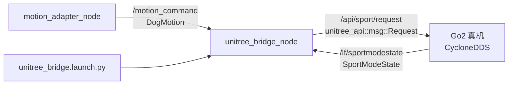

## 用户需求

将当前导航系统的动作输出对接宇树 Go2 真机，使机器狗能按照导航指令实际运动。

## 核心功能

- 新建独立的 `unitree_bridge_node`（方案B，不修改 motion_adapter_node）
- 订阅 `/motion_command`（DogMotion），翻译为宇树 Go2 Sport API 调用
- 发布 `unitree_api::msg::Request` 到 `/api/sport/request`
- 根据 DogMotion 的安全状态和步态，自动切换宇树 API（Move/Damp/StopMove/步态切换）
- 订阅 `/lf/sportmodestate` 获取机器人状态反馈，作为日志和健康检查
- 新增启动文件 `unitree_bridge.launch.py`，支持独立启动或并入现有 launch
- 新增配置文件 `unitree_bridge.yaml`

## 不修改范围

- motion_adapter_node 及其所有现有节点保持不变
- 现有 launch 文件不删除，新增并行启动入口

## 技术栈

- **语言**：Python 3（与现有项目一致）
- **框架**：ROS 2 Humble + rclpy
- **通信中间件**：CycloneDDS（与 Go2 真机通信必需）
- **上游依赖**：`unitree_api` 和 `unitree_go`（从 unitreerobotics/unitree_ros2 的 cyclonedds_ws 编译获得）
- **消息依赖**：`dog_nav_interfaces`（本项目的 DogMotion/SafetyState）

## 实现方案

### 架构策略

新建 `unitree_bridge_node` 作为纯翻译层，保持现有管线不变。节点内部维护一个步态状态机，只在步态变化时发送步态切换 API，速度指令则按 10Hz 持续发送 Move 请求。

### DogMotion 到宇树 API 的完整映射逻辑

| DogMotion.safety_state | DogMotion.allow_motion | 宇树 API 调用 |
| --- | --- | --- |
| STOP / MANUAL | 任意 | `Damp(1001)` — 急停阻尼 |
| PAUSE | false | `StopMove(1003)` — 安全暂停 |
| PAUSE | true | `Move(1008, 0,0,0)` — 原地站立 |
| SLOW / NORMAL / DEGRADED | true | `Move(1008, vx*scale, vy*scale, wz*scale)` |
| 任意 | emergency_stop=true | `Damp(1001)` — 紧急阻尼 |

步态切换仅在 gait 值变化时发送一次（避免每周期重复调用）：

- STAND → 不发 Move（靠 StopMove 维持站立）
- WALK → `StaticWalk(1061)`
- TROT → `TrotRun(1062)`
- CRAWL → `EconomicGait(1063)`

SpeedLimit 映射为 SpeedLevel：

- speed_limit ≤ 0.20 → level 1
- speed_limit ≤ 0.35 → level 2
- speed_limit ≤ 0.60 → level 3
- 其余 → level 4

### 性能与可靠性

- **控制频率**：10Hz 定时发送 Move 请求（Go2 要求持续发送维持运动）
- **步态切换去抖**：仅在 gait 值变化时发送切换命令，避免冗余 API 调用
- **传感器超时保护**：若 `/lf/sportmodestate` 超过 1.5s 无数据，记录 warning 并降级到 StopMove
- **启动顺序**：等待首条 DogMotion 到达后才开始发送控制指令，避免启动瞬间误动作
- **安全设计**：默认初始状态为 Damp，收到允许动作的指令后才切换

## 实现要点

### 依赖安装

- 将 `unitreerobotics/unitree_ros2` 仓库的 `cyclonedds_ws` 放入工作区
- 编译 `unitree_api` 和 `unitree_go` 两个包
- `dog_nav_step56/package.xml` 新增对 `unitree_api` 的依赖声明

### Launch 文件设计

新建 `unitree_bridge.launch.py`（独立启动 bridge 节点），同时更新 `closed_loop_demo.launch.py` 增加可选的 bridge 启动参数。

### 日志策略

- INFO：正常 MotionCommand 翻译（含 vx/vy/wz/gait 摘要）
- WARN：/lf/sportmodestate 超时、步态切换失败
- ERROR：Damp/StopMove 紧急触发
- 复用 rclpy logger，避免引入新日志框架

### 向后兼容

- motion_adapter_node 零改动
- 所有现有 launch 文件保持不变
- 仿真测试场景（不需要真机）照常运行

## Agent Extensions

### MCP

- **GitHub**
- 用途：在实现过程中查阅 unitreerobotics/unitree_ros2 仓库中 Request.msg、SportModeState.msg、ros2_sport_client.h 的最新接口定义，确保 API ID 和 JSON 参数格式与官方一致
- 预期结果：获取精确的消息字段、API ID 常量、JSON 参数 schema，用于 unitree_bridge_node 中正确构造 Request 消息